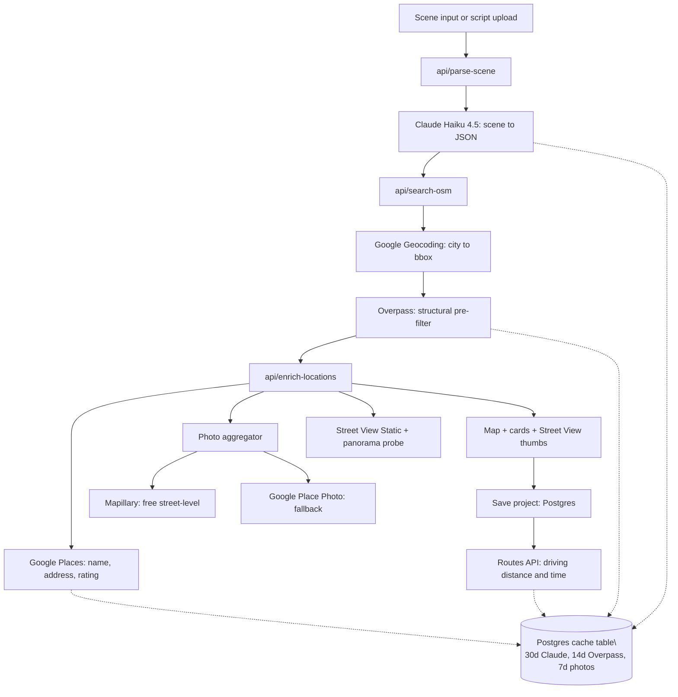

# LocationScout

> AI-powered location scouting for film, music video, and commercial production.
> Describe a scene → get real-world filming locations with photos, Street View,
> and driving distance.

[](https://github.com/Maja-Thurup/location-scout/actions/workflows/ci.yml)
[](./LICENSE)

> **Status:** in active development. M1 (foundation) complete. Scene parsing,
> map results, and saved projects are landing in M2–M5.

---

## What it is

LocationScout reads a natural-language scene description (or a script PDF
upload), extracts structured filming requirements with Claude, then searches
**four independent data sources** in a deliberate pipeline to surface real
filming locations:

1. **Claude (`claude-haiku-4-5`)** parses the scene into structured tags.
2. **OpenStreetMap + Overpass** filters the bounding box by physical attributes
   that Google Places can't see — stories, building material, era, condition,
   roof shape, surface type, abandonment, etc. _Free, unlimited._
3. **Mapillary** supplies free street-level photography for the gritty places
   Google Street View under-covers — alleys, abandoned lots, rural roads.
4. **Google Places (New) + Street View Static + Routes** enrich each
   candidate with name, address, ratings, photos, embedded panoramas, and
   driving time from the user's "crew base."

The architectural unlock is using OSM as a free pre-filter so we never pay
Google for places that don't match the visual brief.



---

## Tech stack

| Layer            | Technology                                                                       |
| ---------------- | -------------------------------------------------------------------------------- |
| Framework        | Next.js 16 (App Router), React 19, TypeScript                                    |
| Styling          | Tailwind CSS v4 (OKLCH colors, dark by default)                                  |
| Auth             | Clerk (Email + Google)                                                           |
| Database         | Supabase Postgres                                                                |
| ORM              | Prisma 6                                                                         |
| Server state     | TanStack Query v5                                                                |
| Forms            | React Hook Form + Zod                                                            |
| AI               | Anthropic Claude API (`claude-haiku-4-5` for parsing)                            |
| Maps + Places    | Google Maps Platform: Places (New), Geocoding, Maps JavaScript, Street View Static, Routes |
| Free photo data  | Mapillary `graph.mapillary.com` (CC BY-SA 4.0, attributed in UI)                 |
| OSM data         | Overpass API (with mirror fallback list)                                         |
| Errors           | Sentry (with source map upload)                                                  |
| Analytics        | PostHog (product analytics + LLM observability)                                  |
| Hosting          | Vercel                                                                           |
| CI               | GitHub Actions (lint + typecheck + build)                                        |

---

## Project structure

```
.
├── app/
│   ├── (auth)/sign-in, sign-up        # Clerk sign-in/up routes
│   ├── (dashboard)/dashboard          # Authenticated dashboard
│   ├── api/health                     # Liveness probe
│   ├── globals.css                    # Tailwind v4 + OKLCH theme
│   ├── layout.tsx                     # Root layout (Clerk + PostHog + Query)
│   └── page.tsx                       # Marketing landing
├── components/
│   ├── contracts.ts                   # Stable component prop signatures
│   ├── footer.tsx
│   ├── posthog-provider.tsx
│   └── query-provider.tsx
├── lib/
│   ├── auth.ts                        # withAuth wrapper for API routes
│   ├── env.ts                         # Server env validation (zod)
│   ├── env-client.ts                  # Client env validation (zod)
│   ├── logger.ts                      # JSON structured logger
│   └── prisma.ts                      # Singleton Prisma client
├── prisma/
│   ├── migrations/                    # Tracked migrations
│   └── schema.prisma                  # User, Project, SavedLocation, Cache, UsageLog
├── instrumentation.ts                 # Sentry server init
├── instrumentation-client.ts          # Sentry client init
├── middleware.ts                      # Clerk auth middleware
├── next.config.ts                     # withSentryConfig wrapper
├── eslint.config.mjs                  # ESLint v9 flat config
├── tsconfig.json                      # TS strict + noUncheckedIndexedAccess
├── LICENSE                            # Proprietary, all rights reserved
└── NOTICE.md                          # Plain-English version of LICENSE
```

---

## Component contracts

Anyone replacing or designing UI for this project should target the prop
signatures in [`components/contracts.ts`](./components/contracts.ts). Adding a
new optional field is non-breaking; renaming or making a field required is
breaking. This is the swap-in mechanism that decouples backend implementation
from the design work.

---

## Running locally

You'll need accounts and credentials for Anthropic, Google Maps Platform,
Mapillary, Supabase, Clerk, Sentry, and PostHog. See `.env.example` for the
full list and where to fetch each one.

```bash
# 1) Clone (or read this repo via the proprietary license — see LICENSE)
git clone https://github.com/Maja-Thurup/location-scout.git
cd location-scout

# 2) Install
npm install

# 3) Configure env
cp .env.example .env.local
#   ...fill in real values

# 4) Generate Prisma client + apply migrations to your dev DB
npx prisma generate
npx prisma migrate deploy

# 5) Start the dev server
npm run dev
```

Then visit `http://localhost:3000`.

### Useful scripts

```bash
npm run dev               # Next.js dev server with HMR
npm run build             # Production build (uploads source maps to Sentry)
npm run typecheck         # tsc --noEmit
npm run lint              # ESLint v9 flat config
npm run lint:fix          # Auto-fix what's auto-fixable
npm run prisma:studio     # Browse the local DB visually
npm run test              # Vitest (unit)
```

---

## License

This repository is **public so it can be reviewed by recruiters and hiring
managers**, but the code is **not open source**. It is proprietary software
licensed under the terms in [`LICENSE`](./LICENSE).

In plain English (see [`NOTICE.md`](./NOTICE.md) for the full version):

- ✅ You may **read** the code as part of a hiring or peer review.
- ❌ You may **not** copy, fork, modify, redistribute, host, sell, or train
  AI/ML systems on this code without prior written permission.

> &copy; 2026 Igor Kirko. All rights reserved.
> Licensing inquiries: igorkirko@gmail.com
